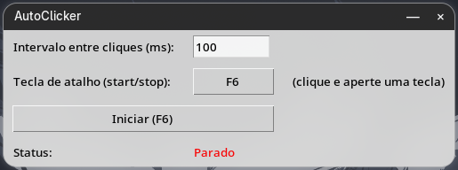

# AutoClicker

Um autoclicker para Linux com interface grafica, inspirado no GS Auto Clicker
(Windows): defina o intervalo entre cliques em milissegundos e uma tecla de
atalho para ligar/desligar, e ela funciona mesmo com outra janela (ou jogo)
em foco.



## Como funciona

- **Interface**: Tkinter, com uma barra de titulo customizada (minimizar,
  fechar, arrastar) ja que muitos compositores Wayland nao desenham
  decoracao nenhuma em janelas Tk/XWayland.
- **Clique simulado**: via [`ydotool`](https://github.com/ReimuNotMoe/ydotool),
  que funciona tanto em X11 quanto em Wayland.
- **Tecla de atalho global**: le o teclado diretamente via
  [`python-evdev`](https://github.com/gvalkov/python-evdev), entao funciona
  mesmo sem foco na janela do AutoClicker.
- **Arrastar a janela**: usa `hyprctl cursorpos` quando disponivel (Hyprland),
  pois consultar a posicao do cursor via X11 enquanto a propria janela esta
  sendo movida causa um bug de coordenadas erradas em compositores Wayland
  (a janela "teleporta" em vez de seguir o mouse suavemente). Em outros
  ambientes, cai para uma consulta X11 padrao (`winfo_pointerx/y`), que
  funciona bem em X11 nativo mas pode nao ser perfeitamente suave em outros
  compositores Wayland — nao testado fora do Hyprland.

## Instalacao

```bash
git clone <url-deste-repo> autoclicker
cd autoclicker
./install.sh
```

O script `install.sh`:

1. Instala as dependencias de sistema (`tk`, `python-evdev`, `ydotool`) —
   detecta automaticamente Arch (`pacman`), Debian/Ubuntu (`apt`), Fedora
   (`dnf`) e openSUSE (`zypper`).
2. Adiciona seu usuario ao grupo `input` (necessario para ler o teclado e
   simular cliques sem precisar rodar como root).
3. Habilita o servico `ydotoold` (`systemctl --user enable --now ydotool`).
4. Cria um atalho "AutoClicker" no menu de aplicativos.

**Depois de instalar, faca logout/login (ou reinicie)** — a mudanca de
grupo (`input`) so vale para sessoes novas.

### Outras distros / gerenciadores de pacote nao suportados

Instale manualmente: `tk` (bindings Tcl/Tk para Python), `python-evdev` (ou
`pip install --user evdev`), e `ydotool`. Depois rode os passos 2-4 do
`install.sh` manualmente (veja o script).

## Uso

Abra pelo menu de aplicativos ("AutoClicker") ou rode `./run.sh`.

- **Intervalo entre cliques (ms)**: quanto menor, mais rapido clica (100ms
  = 10 cliques/segundo).
- **Tecla de atalho**: clique no botao e aperte a tecla desejada (padrao:
  `F6`). Funciona em qualquer janela, nao so quando o AutoClicker esta em
  foco.
- **Arrastar a janela**: clique e segure a barra de titulo escura no topo.

## Requisitos

- Linux (X11 ou Wayland)
- Python 3
- `ydotool` + `ydotoold` rodando
- Usuario no grupo `input`

## Licenca

MIT
